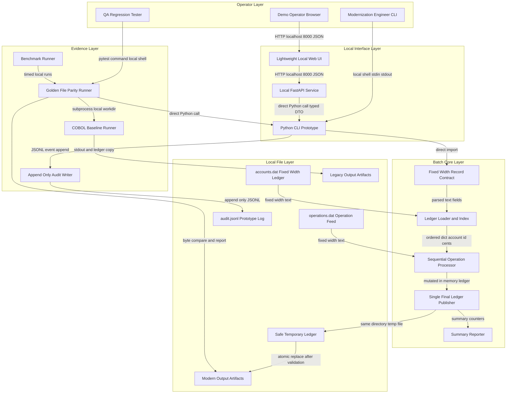
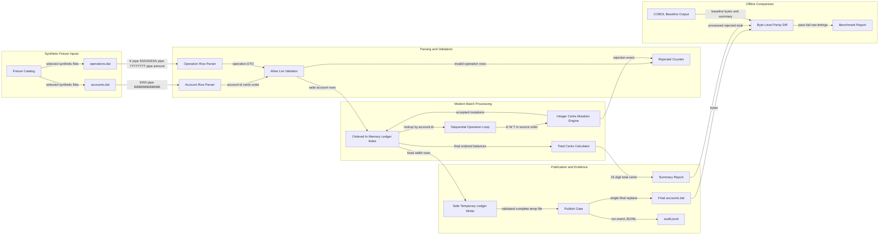
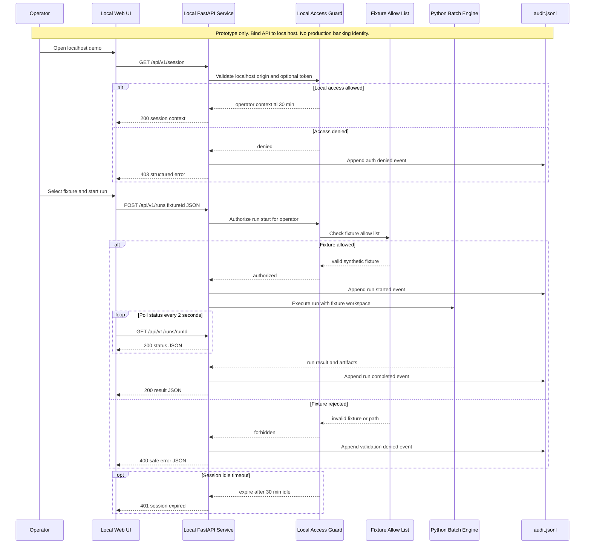
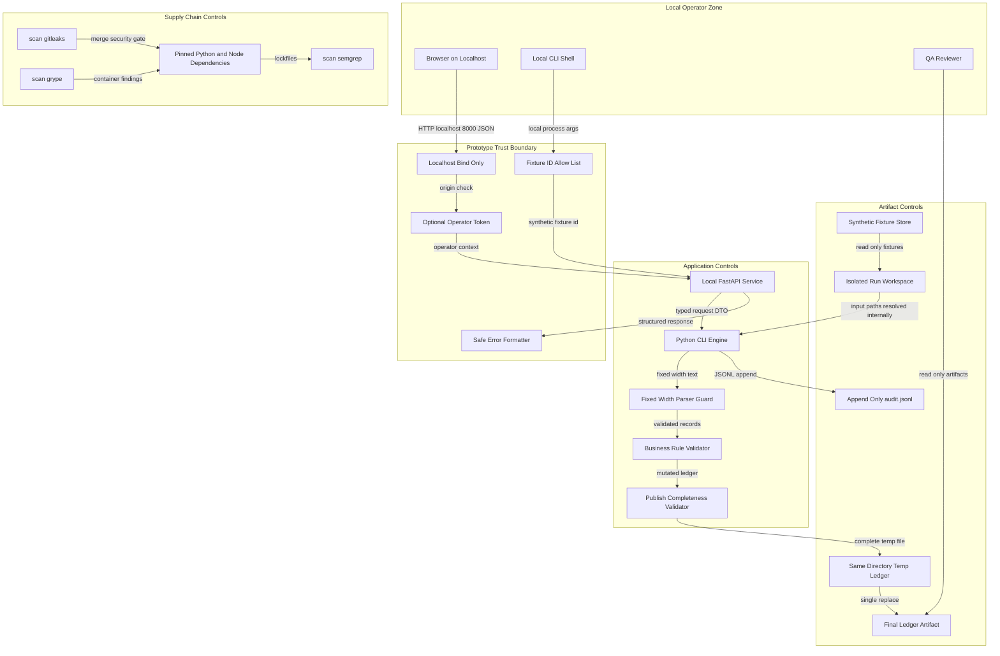
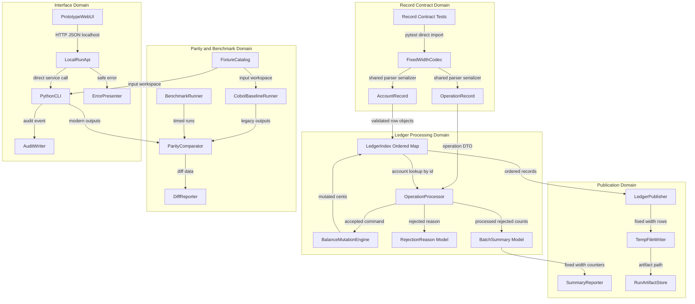
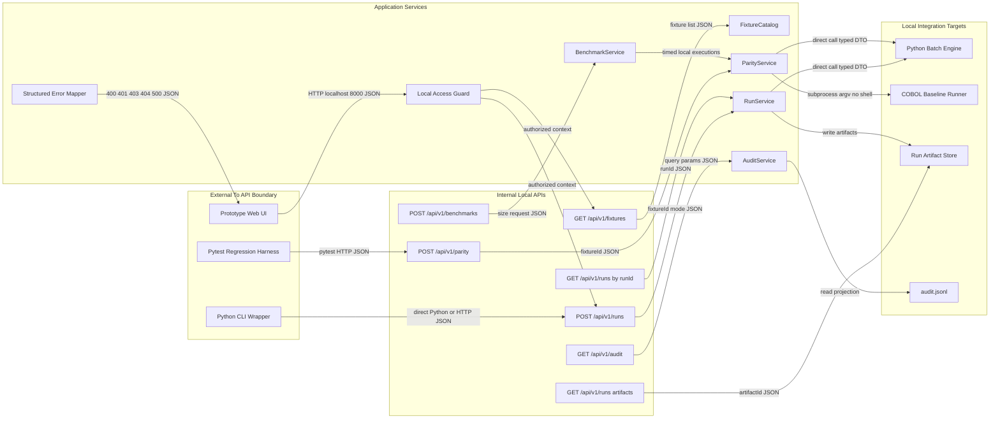
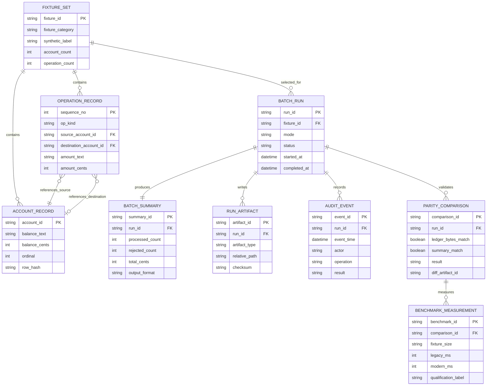
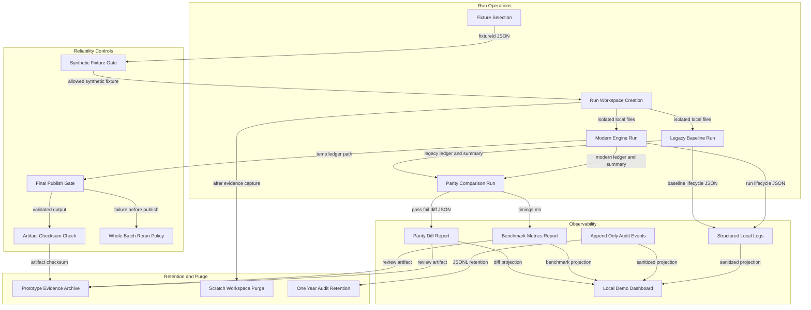

## Architecture Executive Summary

### Project Context

BBS SG Bank is a synthetic educational modernization project for a legacy COBOL nightly ledger batch. The current implementation is a standalone procedural program, `bank.cob`, that reads `operations.dat`, applies deposits, withdrawals, and transfers to `accounts.dat`, rewrites the ledger through `accounts.tmp`, and prints `PROCESSED`, `REJECTED`, and `TOTAL_CENTS`. The users are modernization engineers, QA regression testers, demo operators, technical sponsors, and governance reviewers. The domain is banking-style batch ledger processing, but the architecture must remain explicitly non-production and must not imply real customer data handling, production banking readiness, or formal regulatory certification.

### Architectural Philosophy

1. **Behavior before speed.** The COBOL output remains the source of behavioral truth. The modern engine is not accepted unless final ledger bytes, processed count, rejected count, and total cents match the baseline for required fixtures.
2. **Improve internals without changing contracts.** `accounts.dat` stays `IIIIIIII|BBBBBBBBBBBB`, `operations.dat` stays `K|SSSSSSSS|TTTTTTTT|AAAAAAAAAAAA`, and integer cents remain the only monetary representation.
3. **Local, offline, and reproducible.** The target architecture uses a Python CLI engine, lightweight local web UI, local audit artifacts, and side-by-side execution against synthetic fixtures. No production cutover or live traffic routing is introduced.
4. **Small components with explicit seams.** The current god-file behavior is decomposed into parser, ledger index, operation processor, publisher, parity runner, benchmark runner, audit writer, and demo API. This creates testable seams without over-engineering a one-day prototype.
5. **Fail closed at publication.** Rejected operation rows continue to increment rejected count, but missing files, unreadable fixtures, incomplete final ledgers, or parity mismatches block publication and stakeholder approval.

### Current to Target Transformation

Current state is a two-file repository with the full runtime behavior concentrated in `bank.cob` and a README describing the modernization objective. `bank.cob` repeatedly opens and scans `accounts.dat` for each operation and rewrites the full account file for every accepted operation. That creates an O(m x n) file I/O pattern and many mutation windows. Target state preserves the COBOL program as the baseline runner, introduces a modern Python batch engine that reads the ledger once into an indexed in-memory map keyed by the 8-digit account ID, processes `operations.dat` sequentially, and performs exactly one deterministic final ledger write through a safe temporary file and final replacement step.

The transformation path is a strangler-style offline prototype: first capture baseline outputs, then implement the modern engine, then compare both implementations on shared fixtures, then expose results through CLI reports and a lightweight local web UI. The COBOL baseline and modern engine coexist during the entire prototype; approval is blocked unless outputs match exactly.

### Architecture Decision Records

| Decision | Choice | Alternatives Considered | Rationale | Trade-offs |
|---|---|---|---|---|
| Modern implementation runtime | Python 3.12 CLI engine with optional local FastAPI UI | Keep all logic in COBOL: lowest behavior risk but does not demonstrate Python parity. Full production service: richer platform but violates one-day offline scope. | The intent explicitly calls for a Python CLI application and CLI engine plus lightweight local web UI while retaining COBOL as baseline. Python also enables fast fixture, parity, and benchmark tooling. | Requires maintaining two implementations during prototype and careful byte-level parity checks. |
| Ledger lookup strategy | Load `accounts.dat` once into an ordered in-memory index keyed by account ID | Continue repeated scans: preserves code shape but keeps O(m x n). Use a database: scalable but outside scope and changes operational contract. | Required to eliminate the documented scan bottleneck while preserving flat-file input and deterministic ordering. | Memory usage grows with ledger size, but required benchmark sizes are small enough for local execution. |
| Ledger publication strategy | Accumulate mutations in memory and write one final ledger through same-directory temp output | Per-operation rewrite: proven legacy behavior but high I/O. In-place random updates: faster but risks fixed-width corruption and partial writes. | Meets the requirement for exactly one final write phase and reduces mutation windows compared with `accounts.tmp` per accepted operation. | A failed run cannot resume mid-batch; recovery is best-effort rerun from original inputs. |
| Parity gate | Offline side-by-side runs with byte-level final ledger and summary comparison | Unit tests only: useful but insufficient for COBOL equivalence. Manual inspection: too error prone. | The modernization goal is behavior preservation; parity evidence converts source comments into executable specification. | Requires a repeatable COBOL runner and duplicated fixture execution time. |
| Demo and API boundary | Local-only API for run status, parity reports, benchmark results, audit history, and artifacts | No UI: fastest but weak stakeholder visibility. Public hosted dashboard: stronger demo but raises auth, hosting, and security scope. | Decision anchors require both operator/demo interface and automated tooling while staying educational and offline. | Adds a small API/UI surface that must be secured, labeled, and accessibility-tested. |
| Audit approach | Append-only local JSONL audit artifacts retained as prototype evidence | No audit: simpler but fails traceability requirement. Production audit platform: too heavy for one-day prototype. | Provides traceability for batch started, completed, failed, parity executed, ledger generated, and benchmark measured. | Local append-only files are tamper-evident only at prototype level, not formal compliance storage. |
| Build and verification | Forge Shipping pipeline with Python, Node, Docker, scans, parity tests, benchmarks, and manual approval gate | Local scripts only: faster but weaker repeatability. Production Kubernetes rollout: excessive for offline prototype. | Provides a repeatable delivery envelope without changing the offline execution model. | Pipeline setup may exceed the minimum demo if time is constrained. |

---

## System Architecture Overview

### Overview

The target architecture is intentionally small, local, and layered. The current COBOL baseline remains intact as `legacy-bank` so it can serve as the authoritative comparator. Around it, the modern prototype adds a Python batch core with explicit modules for record contracts, ledger indexing, operation processing, final ledger publication, parity comparison, benchmark execution, and audit writing. A lightweight local API and web UI sit outside the core so the batch engine can be tested directly through CLI without web dependencies.

### Current State Evidence

`bank.cob` combines file assignment, parsing, validation, lookup, mutation, publication, and summary reporting in one procedural source. The file-control section assigns `accounts.dat`, `operations.dat`, and `accounts.tmp` directly from the current working directory. The main procedure reads `operations.dat`, performs `process-operation`, recomputes totals from `accounts.dat`, and prints final counters. This confirms there are no controllers, services, repositories, API routes, database objects, or deployment descriptors today.

### Target State

The architecture separates four concerns:

- **Operator and automation interfaces:** Python CLI, local web UI, and local REST API. The API is not a production banking API; it is a demo and test orchestration surface.
- **Modern batch core:** deterministic business processing with no floats, explicit fixed-width parsing, in-memory ordered ledger state, and one final publish phase.
- **Evidence tooling:** parity runner, benchmark runner, fixture catalog, and diff reporter.
- **Local data and artifacts:** synthetic fixtures, legacy outputs, modern outputs, benchmark reports, and append-only audit JSONL.

### Key Design Points

The Python CLI is the primary entry point because it can run offline and directly supports automated parity. The local UI calls the API only for demo visibility; it must not become the system of record. The COBOL runner is wrapped as a baseline adapter that executes in an isolated working directory to avoid contaminating modern outputs. All writes target run-specific output folders, and only the final modern ledger publication step can replace a target `accounts.dat` in the run workspace after validation passes.

---

## Data Flow Diagram

### End-to-End Data Pipeline

The data architecture remains file-based by design. There is no database migration in this prototype because preserving the legacy flat-file contract is a non-negotiable requirement. The modern flow reads `accounts.dat` once, validates and indexes account records, streams `operations.dat` sequentially, applies accepted operations in memory, and writes the final ledger once. The pipeline keeps original ledger order so final output remains compatible with the COBOL baseline.

### Data Contracts

| File or Artifact | Contract | Ownership | Target Handling |
|---|---|---|---|
| `accounts.dat` | `IIIIIIII|BBBBBBBBBBBB` | Fixture catalog and run workspace | Validate 8-digit ID, pipe delimiter, 12-digit cents, preserve order |
| `operations.dat` | `K|SSSSSSSS|TTTTTTTT|AAAAAAAAAAAA` | Fixture catalog and run workspace | Parse kind at position 1, source at positions 3-10, destination at positions 12-19, amount at positions 21-32 |
| Modern final ledger | Same as `accounts.dat` | Ledger publisher | Write through temporary file, validate complete output, replace only at final publish |
| Summary output | `PROCESSED`, `REJECTED`, `TOTAL_CENTS` | Summary reporter | Preserve 8-digit count widths and 16-digit total width |
| Audit log | JSONL prototype events | Audit writer | Append-only local artifact with actor or process, timestamp, operation, result, and artifact reference |

### Processing Rules

The operation processor must retain reject-and-continue behavior for row-level business validation. Unsupported operation type, non-numeric amount, zero amount, self-transfer, missing source, missing destination for transfer, and insufficient funds increment `rejected` and do not mutate balances. Accepted deposits, withdrawals, and transfers mutate integer-cent balances and increment `processed`. File-level failures such as missing fixture inputs or incomplete temporary output are not row-level rejects; they fail the run before publication.

### Integrity Guarantees

The final ledger publication phase must check that the output record count matches the loaded account count and that every serialized row conforms to the fixed-width account contract. The parity runner then compares the modern final ledger and summary against the COBOL run. This makes data integrity evidence explicit rather than relying on comments in the legacy source.

---

## Authentication & Authorization Flow

### Scope of Authentication

The current COBOL batch has no authentication or authorization. It is a local program that trusts whichever `accounts.dat` and `operations.dat` files exist in the working directory. For the prototype, production identity federation is explicitly out of scope. The architecture therefore uses a local-only operator boundary rather than enterprise OAuth or customer-facing authentication. The local API should bind to `127.0.0.1`, reject non-local origins, and require an optional development operator token if the web UI is enabled beyond a trusted single-user machine.

### Authorization Model

The prototype has two roles:

| Role | Allowed Actions | Denied Actions |
|---|---|---|
| `operator` | Select synthetic fixture, start run, view status, view artifacts, view audit events | Change validation rules, bypass parity gate, upload unrestricted paths |
| `qa` | Run parity fixtures, run benchmarks, inspect diff reports | Mark failed parity as approved, use real customer data |

For local CLI execution, the authorization boundary is operating-system access to the run workspace. For the local web UI, the API enforces allow-listed fixture IDs and denies arbitrary path input to prevent path traversal and accidental real-data use. Sessions, if enabled, should expire after 30 minutes of inactivity because this is a prototype reviewer tool, not a persistent production app.

### Error Handling

Authentication failures return structured local API errors without stack traces, secrets, or host paths. Authorization failures are audit events. Missing or unreadable fixtures fail safely before ledger publication. A parity mismatch is not an authorization failure; it is a validation failure that blocks approval.

### Why Not Enterprise SSO

OAuth 2.0 with PKCE and OIDC are appropriate for production systems, but adding enterprise identity to a one-day offline prototype would create more integration risk than value. The recommended approach keeps the attack surface small while still reflecting access control, auditability, and user-safe errors.

---

## Security Architecture

### Security Posture

The security architecture is scoped to an educational offline prototype. It does not claim production banking compliance, but it must still prevent unsafe file handling, accidental use of real records, output tampering during publication, and leakage of host paths or stack traces. The main trust boundary is the fixture workspace: only allow-listed synthetic fixture IDs can be processed, and arbitrary file paths must never be accepted from the browser or API.

### Current Risks

The legacy COBOL program directly assigns static filenames in the current directory. That means provenance, ownership, permissions, checksum validation, and publish completeness are not evidenced in the current source. The batch also emits only final stdout counters and has no structured audit trail. These are acceptable for a synthetic baseline but must be improved in the target prototype.

### Target Controls

- **Input controls:** restrict fixture selection to known synthetic fixture IDs; validate record length, delimiters, numeric fields, operation kinds, and account ID format.
- **Publication controls:** write final ledger to same-directory temporary output; validate complete record count; replace target only once at final publish.
- **Audit controls:** append JSONL events for run started, completed, failed, parity executed, ledger generated, and benchmark measured.
- **Demo controls:** local-only API binding, safe structured errors, no stack traces, no secrets, no host paths, and prototype labels on every UI report.
- **Supply-chain controls:** pinned dependencies, SCA scans, secret scans, and signed or checksummed artifacts in the delivery workflow.

### Data Classification and Retention

Synthetic fixtures, output ledgers, benchmark reports, diff reports, and audit logs are classified as Internal prototype artifacts. If any real bank or customer record is introduced, the project must stop and re-scope because privacy, encryption, retention, and compliance obligations would change materially. Prototype audit artifacts should follow a one-year retention target when retained for review, while local scratch workspaces may be purged after evidence capture.

---

## Deployment Architecture

### Deployment Scope

This project is not a production service deployment. The deployment architecture describes a reproducible local prototype delivery pipeline that builds and verifies the COBOL baseline wrapper, Python CLI engine, optional FastAPI service, lightweight web UI, fixtures, and test evidence. The pipeline uses the Forge Shipping step catalog because the user selected Forge Shipping as a decision anchor. The goal is repeatability, security scanning, parity gating, and artifact capture, not production traffic rollout.

### Environments

| Environment | Purpose | Promotion Rule |
|---|---|---|
| `dev` | Developer run of CLI, unit tests, and small fixtures | All parser and processor tests pass |
| `staging` | Side-by-side COBOL and modern parity, benchmark fixtures, demo UI review | 100% P0 parity and no critical scan findings |
| `prod` | Archived prototype release artifact only, not live banking production | Manual approval and clear synthetic prototype labeling |

### Pipeline Decisions

The build stage includes `build:python` for the CLI/API/test harness, `build:node` for the optional web UI, and `build:docker` for reproducible local execution. Security scans run in parallel and merge before artifact publication. The deployment stage should deploy only to local or internal demonstration environments; if Kubernetes is used, it should host the demo container for review and not expose a public banking endpoint.

### Gates

Promotion must be blocked by any P0 parity mismatch, any missing required fixture category, any benchmark report that omits the required fixture sizes, any critical dependency or secret finding, or any UI/report that fails to label results as synthetic prototype evidence. Preliminary speedups of 28.6x and 128.1x may be displayed only with the required local single-host qualification.

```mermaid
flowchart LR
  subgraph sourceStage["Source"]
    commitTrigger["VCS commit trigger"]
    prTrigger["VCS pull request trigger"]
    tagTrigger["VCS tag trigger"]
  end
  subgraph buildStage["Build"]
    pythonBuild["build:python"]
    nodeBuild["build:node"]
    dockerBuild["build:docker"]
    cobolCompile["test:generic COBOL compile"]
  end
  subgraph scanStage["Security Scan"]
    sonarqubeScan["scan:sonarqube"]
    snykScan["scan:snyk"]
    gitleaksScan["scan:gitleaks"]
    semgrepScan["scan:semgrep"]
    grypeScan["scan:grype"]
    scanMerge["Security findings merge"]
  end
  subgraph testStage["Test"]
    unitTests["test:generic pytest unit"]
    parityTests["test:generic parity fixtures"]
    benchmarkTests["test:generic benchmark fixtures"]
    accessibilityTests["test:generic accessibility checks"]
  end
  subgraph pushStage["Push"]
    artifactPack["Package prototype artifacts"]
    registryPush["push:jfrog"]
    checksumSign["Generate checksums"]
  end
  subgraph gateStage["Gate"]
    parityGate["Manual approval parity gate"]
    securityGate["Manual approval security gate"]
    demoGate["Manual approval demo gate"]
  end
  subgraph deployStage["Deploy"]
    devDeploy["deploy:docker dev local"]
    stagingDeploy["deploy:kubernetes staging demo"]
    prodArchive["deploy:terraform artifact archive"]
  end
  subgraph verifyStage["Post Deploy Test"]
    speedscaleTest["test:speedscale"]
    genericSmoke["test:generic smoke"]
    accelqTest["test:accelq"]
  end
  commitTrigger -->|"git event"| pythonBuild
  prTrigger -->|"git event"| pythonBuild
  tagTrigger -->|"release tag"| pythonBuild
  pythonBuild -->|"wheel and tests"| dockerBuild
  nodeBuild -->|"static UI bundle"| dockerBuild
  cobolCompile -->|"legacy baseline binary"| dockerBuild
  dockerBuild -->|"container image"| sonarqubeScan
  dockerBuild -->|"container image"| snykScan
  dockerBuild -->|"source tree"| gitleaksScan
  dockerBuild -->|"source tree"| semgrepScan
  dockerBuild -->|"image layers"| grypeScan
  sonarqubeScan -->|"quality report"| scanMerge
  snykScan -->|"dependency report"| scanMerge
  gitleaksScan -->|"secret report"| scanMerge
  semgrepScan -->|"SAST report"| scanMerge
  grypeScan -->|"image CVE report"| scanMerge
  scanMerge -->|"no critical findings"| unitTests
  unitTests -->|"pytest results"| parityTests
  parityTests -->|"100 percent P0 parity"| benchmarkTests
  benchmarkTests -->|"1200x400 and 5000x500 timings"| accessibilityTests
  accessibilityTests -->|"WCAG checklist"| artifactPack
  artifactPack -->|"tar and reports"| registryPush
  registryPush -->|"immutable artifact"| checksumSign
  checksumSign -->|"signed evidence"| parityGate
  parityGate -->|"approved"| securityGate
  securityGate -->|"approved"| demoGate
  demoGate -->|"approved"| devDeploy
  devDeploy -->|"local container"| stagingDeploy
  stagingDeploy -->|"internal demo only"| prodArchive
  stagingDeploy -->|"HTTP localhost JSON"| speedscaleTest
  stagingDeploy -->|"CLI smoke"| genericSmoke
  stagingDeploy -->|"UI scenario"| accelqTest
```

---

## Component Architecture

### Component Boundaries

The component architecture extracts stable seams from the legacy program without changing the business contract. The current `process-operation` paragraph mixes parsing, validation, account lookup, mutation, file rewrite, and processed/rejected counting. Target components separate those responsibilities so each can be tested independently and compared against COBOL behavior.

### Target Components

| Domain | Component | Responsibility |
|---|---|---|
| Record contract | `AccountRecord`, `OperationRecord`, `FixedWidthCodec` | Parse and serialize fixed-width rows exactly |
| Ledger processing | `LedgerIndex`, `OperationProcessor`, `BalanceMutationEngine` | Maintain ordered in-memory ledger and process operations sequentially |
| Publication | `LedgerPublisher`, `SummaryReporter` | Write one final ledger and emit fixed-width-compatible summary counters |
| Evidence | `CobolBaselineRunner`, `ParityComparator`, `BenchmarkRunner`, `FixtureCatalog` | Run side-by-side validation and performance evidence |
| Interfaces | `PythonCLI`, `LocalRunApi`, `PrototypeWebUI` | Provide automation and stakeholder visibility |
| Governance | `AuditWriter`, `ErrorPresenter`, `RunArtifactStore` | Preserve traceability and safe user feedback |

### Coupling and Blast Radius

Today the blast radius of changing validation or publication is effectively the entire batch because `bank.cob` is the only code artifact implementing runtime behavior. The target architecture deliberately introduces internal coupling around the canonical record contract: every component depends on the codec rather than duplicating substring offsets. This is a beneficial coupling because it prevents drift across engine, parity tests, UI rendering, and report generation. The riskiest component is `BalanceMutationEngine`, because it must match COBOL semantics for deposits, withdrawals, transfers, insufficient funds, and self-transfer rejection.

### Implementation Notes

The modern engine should avoid floating point entirely by using Python `int` for cents and string formatting for fixed widths. The ledger index should preserve original row order, for example by storing a list of account IDs plus a dictionary from account ID to mutable balance record. This satisfies constant-time lookup without sacrificing deterministic output order.

---

## API Integration Architecture

### API Scope

There is no existing API in the legacy repository. The target local API is an optional prototype integration boundary for the web UI and demo automation. The CLI remains the primary execution mechanism. API routes must be versioned, structured, and local-only, and must return safe JSON errors with correct HTTP status codes. The API does not expose production banking operations, account management, payment networks, identity, or real-time authorization.

### Proposed Local API Surface

| Method | Path | Purpose | Auth Boundary | Payload |
|---|---|---|---|---|
| `GET` | `/api/v1/fixtures` | List allow-listed synthetic fixtures | Local operator context | JSON fixture catalog |
| `POST` | `/api/v1/runs` | Start modern run or side-by-side run | Local operator context | JSON fixture ID and mode |
| `GET` | `/api/v1/runs/{runId}` | Get status, summary, parity status | Local operator context | JSON run status |
| `GET` | `/api/v1/runs/{runId}/artifacts` | List generated ledgers, summaries, reports | Local operator context | JSON artifact references |
| `POST` | `/api/v1/parity` | Execute COBOL and modern comparison | QA context | JSON fixture ID |
| `POST` | `/api/v1/benchmarks` | Execute required benchmark sizes | QA context | JSON benchmark request |
| `GET` | `/api/v1/audit` | View append-only prototype audit events | Local reviewer context | JSONL projection |

### Integration Boundaries

The local API must never accept raw filesystem paths from the browser. It accepts fixture IDs that resolve internally through `FixtureCatalog`. The COBOL baseline is invoked only through `CobolBaselineRunner` in a controlled workspace. Subprocess execution must use argument arrays rather than shell interpolation. Generated artifacts are referenced by run ID and sanitized artifact ID, not host paths. This preserves the offline demo experience while honoring secure API conventions.

### Error Model

All errors use a structured response such as `{"errorCode":"FIXTURE_NOT_ALLOWED","message":"Fixture is not available for this prototype run","correlationId":"..."}`. Bad input returns 400, unauthorized local access returns 401, forbidden role action returns 403, unknown run or artifact returns 404, and internal failures return 500 without stack traces or host paths.

---

## Database Schema Analysis

### No Database in Current or Target Prototype

The current system uses line-sequential flat files rather than a database. The target one-day modernization prototype should keep this file-based architecture because the fixed-width ledger contract is the core requirement. Introducing a relational database would add migration, schema, transaction, and operational concerns that are outside scope and would undermine byte-level parity with the COBOL baseline.

The diagram below is therefore a logical data model for files and artifacts, not a physical database schema. It captures the entities the architecture must preserve and generate: account records, operation records, batch runs, summaries, parity comparisons, benchmark measurements, artifact references, and audit events.

### Logical Entity Rules

- `AccountRecord` is keyed by 8-digit account ID and contains a 12-digit integer-cent balance. Its `ordinal` preserves source ledger order.
- `OperationRecord` is ordered by source file sequence and contains kind, source account, destination account, amount text, parsed amount cents, and validation status.
- `BatchRun` represents a single modern or side-by-side run against synthetic fixtures.
- `BatchSummary` stores processed count, rejected count, total cents, and summary formatting status.
- `ParityComparison` stores whether final ledger bytes and summary counters match the COBOL baseline.
- `BenchmarkMeasurement` records runtime for required fixture sizes and must label preliminary speedups as local prototype results pending independent review.
- `AuditEvent` records traceable prototype actions without storing secrets or real customer data.

### Why This Matters

A logical schema lets the implementation document data ownership without changing storage technology. It also supports future migration if stakeholders later approve a production-grade platform, but the present prototype remains flat-file and artifact-based.

---

## Technology Stack Summary

### Stack Positioning

The target stack is intentionally modest. COBOL remains as the baseline reference implementation. Python becomes the modern engine and automation layer because the user selected a Python CLI application and the README explicitly frames modernization around COBOL and Python parity benchmark. The web UI is lightweight and local-only, used for stakeholder visibility rather than production banking operations. The stack table distinguishes existing technology from target additions.

| Layer | Technology | Version | Status | Rationale |
|---|---|---:|---|---|
| Legacy baseline language | COBOL | Existing source, compiler to pin as GnuCOBOL 3.2 or approved local equivalent | acceptable | Required as authoritative behavior reference; keep `bank.cob` unchanged for parity baseline. |
| Current runtime architecture | Standalone COBOL batch monolith | Existing | outdated | All runtime behavior is in one procedural file, which increases change blast radius and hides test seams. |
| Current data store | Line-sequential local flat files | Existing | acceptable | Must remain because account and operation fixed-width contracts are non-negotiable. |
| Modern engine language | Python | 3.12 | modern | Fast one-day implementation, strong standard-library file handling, straightforward integer cents, pytest ecosystem. |
| CLI framework | Python argparse or Typer | argparse stdlib or Typer 0.12.x | modern | CLI is primary offline execution surface; argparse minimizes dependencies while Typer improves UX if time permits. |
| API layer | FastAPI with Pydantic | FastAPI 0.115.x, Pydantic 2.x | modern | Typed local API for demo UI, structured validation, and consistent JSON responses. |
| Web UI | React, Vite, Tailwind CSS | React 19, Vite 7, Tailwind 4 | modern | Lightweight local dashboard for run status, parity, benchmarks, audit events, and synthetic prototype labeling. |
| Testing | pytest | 8.x | modern | Fixture-driven parity and unit tests turn legacy behavior into executable specification. |
| Benchmarking | pytest-benchmark or dedicated timing harness | pytest-benchmark 5.x or custom | modern | Records required `1200 x 400` and `5000 x 500` fixture timings with qualified speedup labels. |
| Artifact storage | Local workspace directories and JSONL | Filesystem | acceptable | Appropriate for offline prototype evidence; not a formal production audit store. |
| Audit logging | Append-only JSONL | Local file format | acceptable | Meets prototype traceability without introducing a production logging platform. |
| Containerization | Docker local image | Current stable Docker | modern | Makes COBOL runner, Python engine, tests, and UI reproducible across reviewers. |
| CI and delivery | Forge Shipping pipeline | Step catalog based | modern | Supports build, scan, parity, benchmark, approval, and artifact archive gates. |
| Database | None | N/A | acceptable | No DB is required or evidenced; adding one would exceed scope. |
| Observability | Structured local logs and generated reports | JSONL and HTML or JSON reports | acceptable | Sufficient for offline prototype; production telemetry is out of scope. |

### Version Governance

All dependencies should be pinned in lockfiles. The pipeline must run dependency scanning and secret scanning because even a local prototype can create unsafe reuse patterns if secrets, arbitrary paths, or vulnerable dependencies are introduced. If the prototype evolves beyond local synthetic fixtures, the stack must be re-reviewed for production authentication, encryption, monitoring, backups, and formal data retention.

---

## Architectural Concerns & Recommendations

### Concern Summary

The most important architectural concerns are not missing enterprise platform features; they are behavior drift, repeated file I/O, unsafe file publication, and lack of executable evidence. The current repository is intentionally small and educational, so recommendations should remain proportional to the one-day prototype scope.

| # | Concern | Severity | Impact | Recommendation | Effort |
|---:|---|---|---|---|---|
| 1 | Behavior drift between COBOL and modern engine | Critical | Incorrect balances, rejected counts, or totals would invalidate modernization. | Make COBOL baseline authoritative; block approval unless 100% of P0 fixtures match final ledger bytes, processed count, rejected count, and total cents. | M |
| 2 | O(m x n) full-ledger scans | High | Runtime grows with operations multiplied by account count; required performance target may fail. | Load `accounts.dat` once into an ordered in-memory index keyed by account ID. | M |
| 3 | Per-operation full-file rewrites | High | Excessive write volume and repeated mutation windows. | Accumulate mutations in memory and perform exactly one final write through safe temp output and final replace. | M |
| 4 | Fixed-width formatting drift | High | Outputs may be numerically right but byte-incompatible with legacy consumers. | Centralize parse and serialize logic in `FixedWidthCodec`; compare final ledgers byte-for-byte. | S |
| 5 | Missing automated tests and fixtures | High | Regression safety depends on manual inspection and comments. | Add at least 13 fixture categories covering valid operations, malformed rows, rejection cases, fixed-width formatting, and totals. | M |
| 6 | Current-directory trust boundary | Medium | Wrong or tampered files may be processed accidentally. | Use run workspaces, fixture allow-list IDs, checksum optional validation, and deny arbitrary paths. | M |
| 7 | No structured audit trail | Medium | Prototype runs are not traceable beyond stdout. | Add append-only `audit.jsonl` events for run lifecycle, parity, benchmarks, artifact generation, and failures. | S |
| 8 | Lack of build and runtime reproducibility | Medium | Parity and benchmark results may vary across developer machines. | Containerize local prototype and pin COBOL compiler, Python, Node, and dependencies. | M |
| 9 | Demo UI scope creep | Medium | One-day scope could expand into production banking platform requests. | Label all UI and reports as synthetic prototype; restrict API to fixtures, runs, parity, benchmarks, audit, and artifacts. | S |
| 10 | User-facing error leakage | Medium | Stack traces or host paths could be exposed in demo. | Use structured error mapper and sanitize all exceptions before returning API or UI errors. | S |
| 11 | Accessibility gaps in demo UI | Low | Stakeholder demo may not meet required inclusive access standards. | Apply WCAG 2.1 AA checklist for keyboard navigation, labels, focus, and contrast. | S |
| 12 | Benchmark claim overstatement | Medium | Preliminary speedups may be misunderstood as independent validation. | Display 28.6x and 128.1x only as local prototype results on one host pending independent review. | S |

### Prioritization

Phases 1 through 4 should focus only on parity and correctness: baseline capture, record contract, modern engine, and byte-level comparison. Performance optimization should be accepted only when parity remains green. Demo UI and audit features are valuable but should not displace the core engine and parity gate.

---

## Quality Attributes & NFR Matrix

### NFR Strategy

The modernization is quality-driven: performance improvement is required, but only after behavioral parity is preserved. The architecture sets concrete targets for the one-day prototype while making clear that these are prototype targets, not production banking service-level objectives.

| Attribute | Target | Current | Gap | Priority |
|---|---|---|---|---|
| Performance response time | Modern run at least 2x faster than COBOL baseline for `1200 x 400` and `5000 x 500` fixtures; record raw timings in milliseconds | Legacy performs repeated full-ledger scans and rewrites with O(m x n) file I/O | Need indexed lookup, one final write, benchmark harness, and qualified reports | P0 |
| Throughput | Process required benchmark fixtures in one offline local run each with deterministic output | Current throughput is limited by per-operation account scans and rewrites | Need one ledger load, constant-time account lookup, and single publish | P0 |
| Availability | Local prototype run completes or fails safely with no partial final ledger publication; no uptime SLO because no production service | Current batch assumes local files and rewrites ledger during accepted operations | Need temp output validation and final publish gate | P0 |
| Scalability | Support required fixture sizes and preserve ordering; future scale targets require re-scope | Current design scales poorly as operations and accounts grow | Need memory-bound ledger index and benchmark evidence | P1 |
| Security compliance level | Educational prototype with secure coding, allow-list input validation, auditability, safe errors, and no real records | Current source has no auth, no audit trail, and implicit working-directory trust | Need local access guard, fixture allow list, structured error mapper, and audit JSONL | P1 |
| Maintainability | Components separated by parser, processor, publisher, parity, benchmark, audit, and UI; 100% P0 fixture coverage | Current implementation concentrates behavior in one COBOL file | Need modular Python package and fixtures as executable specification | P0 |
| Data integrity | 100% P0 parity match for final ledger bytes, processed count, rejected count, and total cents | Current behavior exists only in COBOL code and comments | Need side-by-side parity runner and byte-level diff report | P0 |
| Accessibility | 100% of implemented demo screens pass WCAG 2.1 AA checklist | No UI exists today | Need keyboard, focus, contrast, and screen-reader checks | P1 |
| Observability | Audit events for 100% of run start, complete, fail, parity, ledger generation, and benchmark events | Current observability is final stdout summary only | Need append-only audit writer and artifact references | P1 |

### Reliability Model

Row-level validation failures are part of normal batch behavior and should not abort the run. File-level failures, fixture allow-list violations, missing inputs, incomplete temp outputs, and parity mismatches must fail closed before approval or publication. Restart is best-effort: rerun the whole batch from original fixture files; mid-run resume is intentionally out of scope.

### Measurement Approach

Performance reports must include fixture size, legacy runtime, modern runtime, host metadata, command, raw timings, parity result, and qualification label. The preliminary 28.6x and 128.1x values may be included only as local prototype results on one host pending independent review.

---

## Operational Architecture

### Operational Model

Operations are local and artifact-driven. The prototype should produce enough evidence for stakeholder review without introducing production monitoring platforms. The operational architecture centers on run workspaces, structured logs, append-only audit events, parity reports, benchmark reports, and a clear manual approval gate.

### Observability

The legacy system only prints three final lines. The target prototype should emit structured local events for lifecycle transitions and significant validation outcomes. Each event should include a timestamp, actor or process, operation, result, run ID, fixture ID, and artifact reference. Logs and audit events must avoid secrets, stack traces, real customer data, and host paths. The local web UI reads sanitized projections of these artifacts rather than raw filesystem paths.

### Reliability and Recovery

The system uses fail-closed publication. The modern engine writes to a temporary ledger file, validates completeness and fixed-width formatting, and then replaces the run workspace output in one final step. If a run fails before publication, original inputs remain available and the operator reruns the whole batch. If parity fails, modern output is retained as a diagnostic artifact but not approved. There is no mid-run resume or production failover.

### Operational Gates

- **Run gate:** fixture ID must be allow-listed and synthetic.
- **Publish gate:** temporary ledger must be complete and correctly formatted.
- **Parity gate:** COBOL and modern final outputs must match exactly for P0 fixtures.
- **Benchmark gate:** required sizes must be measured and speedups qualified.
- **Demo gate:** UI and reports must clearly label synthetic prototype evidence.

### Retention

Audit and benchmark artifacts should be retained for one year when preserved as prototype evidence. Temporary scratch workspaces can be purged after reports and checksums are captured.

---

## Migration & Transformation Plan

### Migration Phases

| Phase | Duration Estimate | Scope | Entry Criteria | Exit Criteria | Rollback Strategy |
|---|---:|---|---|---|---|
| 1. Baseline capture and fixture inventory | 1.5 hours | Pin or document COBOL runner, create initial synthetic fixtures, capture legacy outputs and stdout summaries | `bank.cob` can compile or run in local environment; fixture categories are agreed | Legacy baseline runs successfully and outputs ledger plus `PROCESSED`, `REJECTED`, `TOTAL_CENTS` for seed fixtures | Stop modernization, keep COBOL-only demo, fix runner or fixtures before continuing |
| 2. Canonical record contract | 1 hour | Implement account and operation parsers, serializers, width checks, delimiter checks, and integer-cent formatting | Phase 1 outputs available; fixed-width positions confirmed | Parser tests prove account and operation rows preserve legacy offsets and formatting | Revert parser changes and use source comments plus COBOL behavior to correct contract |
| 3. Modern indexed batch engine | 2.5 hours | Load `accounts.dat` once into ordered in-memory ledger index, process operations sequentially, preserve reject-and-continue semantics | Record contract tests pass | Modern engine runs deposits, withdrawals, transfers, and rejection cases without final publication drift | Discard modern output and rerun COBOL baseline for all fixtures |
| 4. Single final publication | 1.5 hours | Implement temp ledger writer, completeness validation, one final replacement, summary reporter | Modern engine produces in-memory final state | Exactly one final write phase occurs and final ledger preserves account order and fixed-width formatting | Delete temporary and modern output artifacts; retain original inputs and COBOL outputs |
| 5. Offline parity gate | 2 hours | Run COBOL and modern engine side by side across P0 fixtures and block mismatches | COBOL runner, modern engine, and publisher are available | 100% P0 fixtures match final ledger bytes, processed count, rejected count, and total cents | Mark modern run unapproved; retain diff; continue using COBOL baseline as source of truth |
| 6. Benchmark and evidence package | 1.5 hours | Measure `1200 x 400` and `5000 x 500` fixture sizes, generate reports, qualify preliminary speedups | P0 parity passes for functional fixtures | Raw timings, parity status, host details, and qualified speedup labels are captured | Remove or downgrade performance claims if benchmark cannot reproduce or parity fails |
| 7. Local demo and audit surface | 2 hours | Add local API/UI or report view for run status, parity, benchmark timing, rejection summary, artifacts, and audit events | Core engine and parity artifacts are stable | Demo screens or reports are labeled synthetic prototype and show no stack traces, secrets, or host paths | Fall back to CLI-generated reports and defer interactive UI |
| 8. Stakeholder review and archive | 1 hour | Review evidence with engineering, QA, demo operator, sponsor, and governance reviewer | Evidence package complete | Go/no-go decision recorded with open risks and next steps | Do not promote prototype evidence; archive baseline and failed diffs only |

### Coexistence Strategy

The legacy and modern systems coexist offline. The COBOL baseline remains authoritative and is never overwritten by the modern implementation. For every fixture run, the harness creates separate working directories: one for COBOL baseline output and one for modern output. Inputs are copied from the same synthetic fixture source into both workspaces. There is no dual-write to a shared production ledger, no live traffic routing, and no canary with real records.

Data synchronization is fixture-copy based: both engines receive identical `accounts.dat` and `operations.dat`. The modern path writes its own final ledger artifact. The comparator reads both outputs and produces a parity result. Feature flagging is local and mode-based: `legacy`, `modern`, `side_by_side`, and `benchmark`. The UI and CLI must default to `side_by_side` for approval workflows.

Migration health is monitored through run status, audit events, parity pass rate, diff artifact count, benchmark timing, and fixture coverage. Any P0 parity failure blocks approval. Any missing required fixture category blocks sign-off even if existing fixtures pass.

### Validation Criteria

- **Data integrity checks:** final ledger byte comparison, fixed-width row validation, record count equality, deterministic account ordering, processed count equality, rejected count equality, and total cents equality.
- **Functional coverage:** at least 13 categories: deposits, withdrawals, transfers, malformed rows, insufficient funds, missing source, missing destination, self-transfer, invalid type, non-numeric amount, zero amount, fixed-width formatting, and final totals.
- **Performance comparison:** benchmark both `1200 x 400` and `5000 x 500`; target at least 2x modern improvement over COBOL baseline; label 28.6x and 128.1x only as local prototype results on one host pending independent review.
- **Security validation:** fixture allow-list tests, path traversal negative tests, safe error tests, audit event completeness, no real data checklist, no secrets in logs.
- **User acceptance:** modernization engineer confirms CLI usability; QA confirms parity evidence; demo operator confirms run visibility; governance reviewer confirms synthetic scope and audit posture.

### Final Cutover Position

There is no production cutover in this phase. The only approved outcome is a validated offline prototype. If stakeholders later request production use, a new architecture decision must address authentication, encryption, retention, monitoring, locking, backup, restore, incident response, and formal compliance scope.
---

## Confidence

Overall: **100%**

| Section | Score | Why | How to Improve |
|---------|-------|-----|----------------|
| Intent Alignment | 100% | All 3 intent features covered. | Intent is well-captured. Consider adding comments for priority rankings or phasing details. |
| Policy Compliance | 100% | All 24 policies addressed. | Good policy alignment. Verify any industry-specific regulations are covered. |
| Context Documents | N/A | Not provided — no documents uploaded for this dimension. | Upload the relevant documents to enable this check. |
| Structural Completeness | 100% | All 6 required sections present. | All expected sections are present. Add comments on any section if you want more depth. |

> Strongly aligned with project intent and provided context.