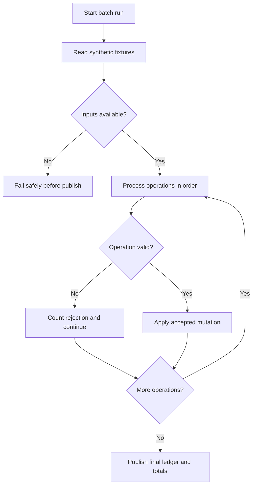
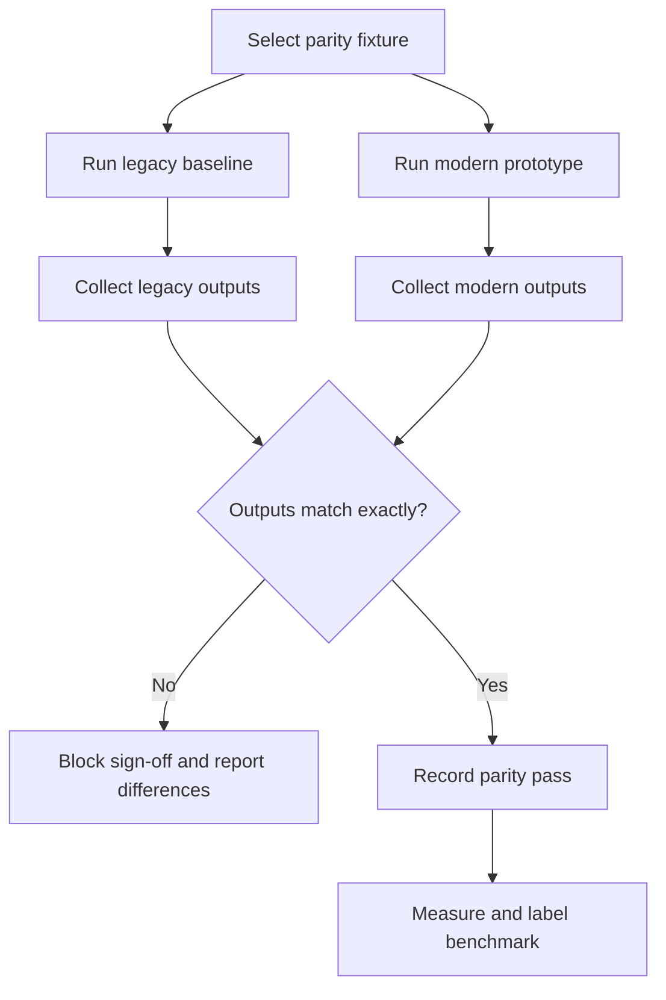
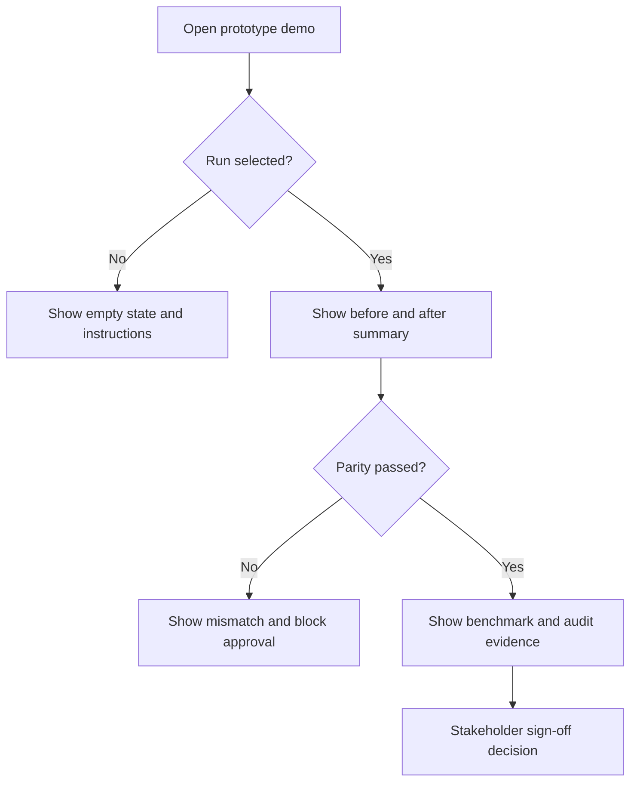
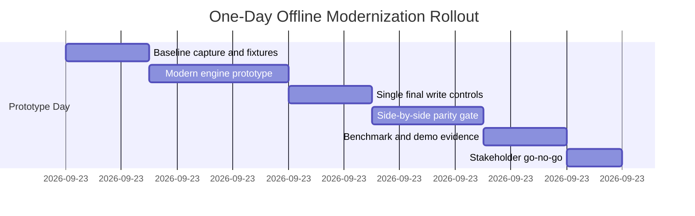

## Executive Summary

The current BBS SG Bank batch is a synthetic educational COBOL ledger processor that applies deposits, withdrawals, and transfers from a fixed-width operations file to a fixed-width account ledger. Its current limitation is intentional but material for modernization learning: each operation can trigger a full ledger scan, and each accepted operation rewrites the entire account file. This creates an O(m × n) file-I/O pattern that becomes disproportionately expensive as account and operation fixture sizes grow.

The target state is a one-day working modernization prototype that preserves the existing ledger contract, cent-accurate behavior, rejection semantics, and summary output while replacing repeated ledger scans with indexed in-memory lookups and replacing per-operation rewrites with one deterministic end-of-batch write. The prototype also adds golden-file parity and benchmark evidence so stakeholders can compare the legacy COBOL baseline and modern implementation side by side before any approval.

The primary beneficiaries are modernization engineers, QA/regression testers, and demo stakeholders. The value proposition is risk-controlled modernization: demonstrate measurable performance improvement without changing business behavior, while keeping the solution explicitly scoped to synthetic educational fixtures rather than production banking or real customer records. Transition impact is intentionally narrow: legacy behavior remains the reference, modern output must match exactly, and rollout proceeds offline only through fixture-based side-by-side validation.

---

## Business Objectives and Success Criteria

| Objective | Current State (Before) | Target State (After) | Success Criteria | Measurement Method |
|---|---|---|---|---|
| Preserve ledger behavior during modernization | Ledger behavior exists only in the COBOL program and comments, with no executable parity suite | Legacy COBOL output is treated as the authoritative baseline for every fixture | 100% of P0 parity fixtures match legacy final account output, processed count, rejected count, and total cents before sign-off | Offline side-by-side run comparing legacy and modern outputs on the same fixtures |
| Reduce batch processing cost caused by repeated file I/O | Each operation can scan the account ledger, and each accepted operation can rewrite the full ledger | Accounts are loaded once into an indexed structure and written once after all operations | [ASSUMPTION] Modern prototype is at least 2x faster than the COBOL baseline on both required benchmark fixture sizes; preliminary local results of 28.6x and 128.1x remain labeled pending independent review | Benchmark harness measuring `1,200 accounts × 400 operations` and `5,000 accounts × 500 operations` |
| Establish repeatable modernization evidence | No visible automated tests, benchmark fixtures, or CI workflow are present | Golden-file fixtures and benchmark outputs become reviewable evidence | At least 13 fixture categories are covered: deposits, withdrawals, transfers, malformed rows, insufficient funds, missing source, missing destination, self-transfer, invalid type, non-numeric amount, zero amount, fixed-width formatting, and final totals | Test report showing fixture coverage and pass/fail status |
| Improve demo stakeholder visibility without implying production readiness | Current batch prints only three summary lines to standard output | Prototype demo surface shows run status, parity result, benchmark timing, rejection summary, and audit events | 100% of demo screens and generated reports are labeled “synthetic prototype” and expose no real customer or banking-production claims | Demo checklist and review sign-off |
| Reduce mutation-window risk during ledger publication | The ledger is rewritten after every accepted operation | Only one final ledger publication step occurs after all operations are processed | Exactly one final ledger write phase per batch; no per-operation ledger rewrite in the modern path | Run logs and file artifact comparison showing one publish phase per completed batch |

---

## Personas and Stakeholders

| Name | Type | Role | Goals | Pain Points | How Served |
|---|---|---|---|---|---|
| Modernization Engineer | Persona | Builds the modern batch prototype while preserving legacy behavior | Replace inefficient internals without changing ledger semantics | Business rules are embedded in a single legacy program and comments | Receives explicit record contracts, parity gates, and migration requirements |
| QA / Regression Tester | Persona | Validates behavior and benchmark evidence | Confirm legacy and modern outputs match exactly across normal and edge cases | No existing automated tests or golden fixtures are present | Receives fixture requirements, byte-level comparison criteria, and benchmark targets |
| Demo Operator | Persona | Runs before/after demonstration for technical stakeholders | Show run status, timing, rejection summaries, and parity results clearly | Existing batch output is limited to aggregate counters | Receives a prototype/demo interface requirement with accessible states and non-production labeling |
| Technical Sponsor | Stakeholder | Funds and approves the one-day prototype | Demonstrate modernization ROI without expanding into a production banking program | Performance value may be questioned if evidence is not repeatable | Receives measurable success gates, cost-benefit framing, and side-by-side validation |
| Governance / Security Reviewer | Stakeholder | Reviews prototype-safe handling of financial-style data | Ensure no real customer-data or production-compliance claims are implied | Financial terminology can create incorrect regulatory expectations | Receives data classification, input validation, auditability, and retention requirements scoped to synthetic fixtures |
| Future Maintainer | Stakeholder | Maintains the legacy baseline and modern prototype after the demo | Understand record layouts and batch behavior without re-reading all COBOL logic | Parsing offsets and rejection behavior are not separated into reusable contracts | Receives canonical business rules, fixtures, and documentation requirements |

---

## User Stories and Acceptance Criteria

| ID | As a... | I want to... | So that... | Priority | Acceptance Criteria |
|---|---|---|---|---|---|
| US-001 | Modernization engineer | load the account ledger once into an indexed in-memory structure keyed by 8-digit account ID | operation processing avoids repeated full-ledger scans while preserving account lookup behavior | P0 | Given a valid account ledger, when the modern batch starts, then it reads the ledger once before operation processing; Given operation records are processed, when source or destination accounts are needed, then lookups use the indexed structure; Given the batch completes, then account ordering remains deterministic and compatible with the original ledger order. |
| US-002 | Modernization engineer | process deposits, withdrawals, and transfers sequentially in operation-file order | accepted and rejected outcomes remain consistent with the legacy baseline | P0 | Given operation kind `D`, `W`, or `T`, when the amount and account conditions are valid, then the operation is applied using integer cents; Given an operation is unsupported, non-numeric, zero amount, missing an account, self-transfer, or insufficient funds, when it is encountered, then it is rejected, the rejected count increments, and the batch continues. |
| US-003 | Modernization engineer | accumulate accepted balance mutations in memory and publish the ledger once | the prototype reduces write volume and avoids per-operation mutation windows | P0 | Given operations have been processed, when finalization begins, then exactly one ledger write phase occurs; Given the temporary ledger is incomplete, when publication is evaluated, then the target ledger is not replaced; Given the temporary ledger is complete, then replacement occurs only at the final publish step. |
| US-004 | QA / regression tester | run golden-file parity tests across legacy and modern implementations | behavior drift is detected before sign-off | P0 | Given a fixture set, when both implementations run against the same inputs, then final account output, processed count, rejected count, and total cents are compared; Given any mismatch exists, then the build is blocked and the mismatch is reported; Given all comparisons match, then the fixture passes. |
| US-005 | QA / regression tester | benchmark both required fixture sizes | the sponsor can evaluate performance improvement with transparent evidence | P1 | Given fixture size `1,200 × 400`, when the benchmark runs, then runtime is recorded for legacy and modern versions; Given fixture size `5,000 × 500`, when the benchmark runs, then runtime is recorded for legacy and modern versions; Given preliminary speedup values are shown, then they are labeled as local prototype results on one host pending independent review. |
| US-006 | Demo operator | view run status, parity result, benchmark timing, rejection summary, and generated artifacts in a prototype/demo interface [ASSUMPTION — no existing UI/API code is evidenced] | non-engineering stakeholders can understand before/after behavior | P1 | Given no run has been selected, when the demo interface loads, then it shows an empty state with instructions; Given a run is in progress, then it shows a loading/progress state; Given a run fails, then it shows a user-safe error without stack traces, secrets, or host paths; Given a run completes, then it labels results as synthetic prototype evidence. |
| US-007 | Governance / security reviewer | receive audit evidence for batch runs and artifact generation | prototype activity is traceable without implying formal compliance certification | P1 | Given a batch run starts, completes, fails, executes parity, generates a ledger, or records a benchmark, then an audit event is captured with actor or process, timestamp, operation, result, and artifact reference; Given logs are displayed, then sensitive values and host paths are not exposed. |
| US-008 | QA / regression tester | validate malformed and empty input conditions | edge cases do not silently produce incorrect outputs | P0 | Given `operations.dat` is empty, when the batch runs, then processed and rejected counts remain zero and total cents reflects the unchanged ledger; Given a malformed row is present, when it is processed, then it is rejected rather than silently corrected; Given an input file is missing or unreadable [ASSUMPTION — modern harness handles file-level failures explicitly], then the run fails gracefully before publishing a ledger. |

---

## Business Process Overview

### Process 1: Nightly Ledger Update — Current and Target

**Business purpose:** Apply a synthetic nightly operation feed to a flat-file account ledger while producing reconciliation totals. The modernization changes the internal processing pattern, not the business outcome.

**Trigger event:** A modernization engineer, tester, or demo operator starts a batch run against selected synthetic fixture files.

**Step-by-step flow, decisions, inputs, and outputs:**
1. **Select fixture inputs** — Participant: operator/test harness. Input: synthetic account and operation files. Output: run request. If files are missing or malformed at the file level, the modern target flow fails before ledger publication.
2. **Load account ledger** — Current: ledger is repeatedly reopened as needed. Target: ledger is loaded once into an indexed structure. Input: account rows. Output: account state for processing.
3. **Read operation feed in order** — Participant: batch engine. Input: ordered operation records. Output: candidate operations.
4. **Validate each operation** — Decision: accepted or rejected. Input: operation kind, source/destination account IDs, amount. Output: accepted mutation or rejected count.
5. **Apply accepted operation** — Current: rewrite the ledger for each accepted operation. Target: mutate in-memory ledger state.
6. **Finalize ledger and totals** — Current: scan final ledger and print totals. Target: write one final ledger, compute totals, and emit summary.

**Error/exception paths:** Invalid records are rejected and do not abort the batch. Missing file, unreadable file, or failed final publication in the modern flow must stop publication and return a user-safe failure state.

**Business outcome achieved:** A deterministic final ledger and summary totals that match legacy behavior while reducing repeated file work.

### Process 2: Offline Parity and Benchmark Validation

**Business purpose:** Prove the modern implementation preserves COBOL behavior before any stakeholder approval. This process is the primary sign-off model and remains offline only.

**Trigger event:** QA or the regression harness initiates a parity run for a fixture category or benchmark size.

**Step-by-step flow, decisions, inputs, and outputs:**
1. **Choose fixture set** — Input: fixture category and size. Output: selected account and operation files.
2. **Run legacy baseline** — Participant: baseline runner. Input: selected fixtures. Output: legacy final ledger and summary.
3. **Run modern prototype** — Participant: modern engine. Input: same selected fixtures. Output: modern final ledger and summary.
4. **Compare outputs** — Decision: exact match or mismatch. Input: both ledgers and summary values. Output: parity pass/fail.
5. **Measure runtime** — Input: run timing data. Output: benchmark report with labels.
6. **Approve or block** — Decision: if any mismatch exists, sign-off is blocked.

**Error/exception paths:** If either implementation fails to run, the parity result is failed. If outputs differ, the run is blocked and differences are retained for diagnosis. Preliminary speedups must not be presented as independently validated.

**Business outcome achieved:** Stakeholders receive reviewable evidence that modernization improves internals without changing behavior.

### Process 3: Prototype Demo Review

**Business purpose:** Help non-engineering stakeholders understand the before/after modernization value without implying production banking readiness. This process is [ASSUMPTION] because no existing UI/API implementation is present in the current repository.

**Trigger event:** A demo operator selects a fixture run or benchmark report for stakeholder review.

**Step-by-step flow, decisions, inputs, and outputs:**
1. **Open demo surface** — Input: selected run or fixture. Output: run context and prototype disclaimer.
2. **Show current versus target results** — Input: legacy and modern summaries. Output: before/after processing view.
3. **Show parity status** — Decision: pass, fail, or not yet run. Output: clear status and next action.
4. **Show benchmark evidence** — Input: timing data. Output: labeled speedup evidence.
5. **Show audit trail** — Input: run events. Output: traceable run history.
6. **Collect sign-off decision** — Decision: approve prototype evidence or request rework.

**Error/exception paths:** Empty states guide the operator when no run exists. Failed runs show safe messages without stack traces, secrets, or host paths. Accessibility failures block demo acceptance.

**Business outcome achieved:** Sponsors can review prototype value, limitations, and evidence in a controlled, accessible, non-production experience.

---

## Business Rules and Policies

| Rule | When It Applies | User Experience | Example |
|---|---|---|---|
| Fixed-width account format must be preserved | Whenever account ledger data is read, displayed, compared, or written | Users see account outputs that remain compatible with the legacy contract; invalid ledger rows are surfaced as fixture/data issues rather than silently reformatted | Account records remain `8-digit account ID`, pipe delimiter, and `12-digit integer-cent balance`; a malformed account fixture blocks or flags the run depending on test design |
| Fixed-width operation format must be preserved | Whenever operation input is parsed or validated | Invalid operation rows are rejected or reported according to the legacy-compatible validation path | Operation kind, source ID, destination ID, and amount are read from the established fixed positions; a short or malformed row is rejected rather than corrected |
| Monetary values use integer cents only | Whenever balances or operation amounts are calculated | Stakeholders receive cent-accurate outputs with no floating-point rounding differences | A transfer of 000000001250 subtracts exactly 1,250 cents from source and adds exactly 1,250 cents to destination |
| Unsupported or unsafe operations are rejected and the batch continues | Whenever an operation has an invalid type, non-numeric amount, zero amount, self-transfer, missing account, or insufficient funds | The run continues and rejected count increases; the invalid operation does not mutate balances | A transfer from an account to itself increments rejected count and does not change either balance |
| Accepted operations increment processed count | Whenever a deposit, withdrawal, or transfer passes all validation | The run summary reports accepted work separately from rejected work | A valid withdrawal with sufficient funds increments processed count by 1 |
| Final summary contract must be preserved | At the end of every successful batch run | Users receive the same three business totals as the legacy baseline | Summary includes processed count, rejected count, and total cents in fixed-width-compatible format |
| Prototype data must remain synthetic | Across fixtures, reports, audit events, demos, and documentation | The interface and reports clearly state that no real bank or customer records are used | A benchmark report is labeled “synthetic prototype evidence” rather than “production banking result” |
| User-supplied fixture inputs must use allow-list validation | When fixtures are uploaded, selected, or executed through any demo/tooling surface | Invalid files produce actionable user-safe errors without stack traces or host paths | A fixture containing an unsupported operation type is rejected by business validation; a fixture with a disallowed filename or path is rejected before execution |
| Audit evidence must be retained for prototype review | Whenever a run starts, completes, fails, generates output, or records a benchmark | Reviewers can trace what was run, when, by whom or what process, and what result occurred | A completed benchmark stores event time, fixture size, parity status, duration, and artifact references; [ASSUMPTION] retained for at least 1 year if audit logging is implemented |
| Demo UI must meet accessibility requirements | Whenever a user-facing demo surface is implemented | Keyboard users, screen-reader users, and users needing sufficient contrast can operate the prototype | Run status, errors, tables, and downloads meet WCAG 2.1 AA expectations |
| Internationalization is not required for MVP, but numeric formatting is fixed | For the one-day prototype demo | Users see legacy-compatible numeric formats rather than locale-specific currency formatting | Total cents remains a numeric cents field, not `$1,234.56` or localized currency text |

---

## Success Metrics and KPIs

| Metric | Target | Measurement Method | Timeline | Business Impact |
|---|---:|---|---|---|
| **Primary: Parity pass rate** | 100% of P0 fixtures pass with exact final ledger and summary match | Golden-file comparison report | By end of 2026-09-23 prototype day | Confirms modernization preserves business behavior |
| **Primary: Required fixture coverage** | At least 13 fixture categories implemented and executed | Test inventory and run report | By end of 2026-09-23 prototype day | Converts legacy behavior into executable specifications |
| **Primary: Performance improvement threshold** | [ASSUMPTION] Modern run is at least 2x faster than legacy baseline for both required benchmark sizes | Benchmark harness comparing legacy and modern durations | By end of 2026-09-23 prototype day | Demonstrates measurable ROI beyond parity |
| **Secondary: Ledger write reduction** | Exactly 1 final ledger write phase per completed modern batch | Run instrumentation or artifact log | By end of 2026-09-23 prototype day | Reduces mutation windows and file-I/O volume |
| **Secondary: Benchmark transparency** | 100% of reports label 28.6x and 128.1x values as local prototype results pending independent review | Report content review | By demo review | Prevents overstatement of preliminary speedup claims |
| **Secondary: Demo accessibility** | 100% of implemented demo screens pass WCAG 2.1 AA checklist for keyboard navigation, screen-reader labels, and contrast | Accessibility checklist/manual test | Before stakeholder demo | Makes prototype review inclusive and policy-aligned |
| **Secondary: Audit completeness** | 100% of batch start, batch completion, batch failure, parity execution, ledger generation, and benchmark measurement events are recorded [ASSUMPTION if audit module is implemented] | Audit event review | Before stakeholder demo | Improves traceability and review confidence |
| **Guardrail: Behavior drift** | 0 unmatched final ledgers or summary counters in sign-off fixtures | Parity diff report | Continuous during prototype validation | Prevents performance improvements from changing ledger outcomes |
| **Guardrail: Real-data exposure** | 0 real customer or production bank records used | Fixture source review | Continuous | Maintains educational prototype boundary |
| **Guardrail: User-safe error handling** | 0 user-facing errors expose stack traces, secrets, or host paths | Error-state review and negative tests | Before demo | Reduces security and credibility risk |

---

## Risks Assumptions Dependencies and Constraints

### Risks

| Risk | Probability | Business Impact | Trigger Conditions | Mitigation | Owner |
|---|---|---|---|---|---|
| Feature parity gap between legacy and modern runs | High | Incorrect balances or rejection counts would invalidate the prototype | Any fixture mismatch in final ledger, processed count, rejected count, or total cents | Block sign-off until exact parity is restored; expand fixtures around the failing case | QA / Regression Tester |
| Fixed-width formatting drift | Medium | Output may be numerically correct but incompatible with legacy consumers | Differences in padding, field width, delimiter placement, newline handling, or ordering | Use byte-level golden comparisons and canonical record-contract documentation | Modernization Engineer |
| Business continuity during cutover | Low | Offline demo evidence may be misunderstood as production cutover readiness | Stakeholders ask to use prototype against real customer or production data | Maintain offline-only side-by-side approval; explicitly label non-production scope | Technical Sponsor |
| Data migration integrity and rollback failure | Medium | A failed final write could overwrite or obscure baseline outputs | Temporary output is incomplete, comparison fails, or generated ledger is published early | Retain original inputs, publish only after complete temp output, and document discard/rerun rollback | Modernization Engineer |
| Performance claims overstated | Medium | Sponsor trust may be harmed if preliminary speedups are treated as independent benchmarks | Reports display 28.6x or 128.1x without qualification | Label all preliminary speedups as local single-host prototype results pending independent review | Demo Operator |
| Prototype UI/API scope creep [ASSUMPTION] | Medium | One-day delivery could expand into production-platform work | Requests for authentication, real-time processing, payment networks, or live banking workflows | Keep demo surface limited to fixture execution, run status, parity, audit, and benchmark review | Product Owner |
| Dependency upgrade cascade [ASSUMPTION] | Low | Tooling choices could require additional package or runtime setup beyond the one-day prototype | Adding a modern API/UI/test stack introduces incompatible dependency requirements | Pin minimal tooling, prefer local scripts, and defer production platform concerns | Modernization Engineer |
| Accessibility or security policy gap in demo surface | Medium | Demo cannot be approved for stakeholder use | UI lacks keyboard support, exposes stack traces, or accepts unsafe fixture inputs | Apply WCAG 2.1 AA checklist, allow-list validation, and user-safe error messages | Governance / Security Reviewer |

### Assumptions

| Assumption | Impact if Wrong | Validation Plan |
|---|---|---|
| [ASSUMPTION] The modern implementation language/runtime can be chosen for rapid prototype delivery while keeping COBOL as the baseline | Delivery plan may need to change if the target runtime must remain COBOL-only | Sponsor confirms target runtime before implementation starts |
| [ASSUMPTION] A minimum 2x speedup is an acceptable explicit prototype threshold | Success metric may be too low or too high for sponsor expectations | Review threshold with technical sponsor before demo sign-off |
| [ASSUMPTION] Operator/demo interface can be lightweight and prototype-only | If stakeholders require production-grade UX/API, one-day scope is not feasible | Confirm demo expectations and label all surfaces as synthetic prototype |
| [ASSUMPTION] Audit events can be stored as prototype artifacts rather than a production audit platform | If formal compliance storage is required, scope and timeline expand | Governance reviewer confirms educational-prototype audit posture |
| [ASSUMPTION] Fixture data remains synthetic and can be versioned in the repository or test artifacts | If real data is introduced, privacy, retention, and compliance obligations change materially | Fixture source review before any benchmark or demo |

### Dependencies

| System/Team | Dependency | Timeline | Impact if Delayed |
|---|---|---|---|
| Modernization engineering | Modern batch engine and record contract implementation | 2026-09-23 | Blocks parity testing and demo evidence |
| QA / regression testing | Golden fixture creation and comparison harness | 2026-09-23 | Blocks sign-off and risks behavior drift |
| Baseline COBOL environment | Ability to run the legacy baseline consistently | 2026-09-23 | Prevents side-by-side parity validation |
| Demo/operator tooling | Prototype run review surface or generated report | 2026-09-23 | Reduces stakeholder visibility but does not block core engine validation |
| Governance/security review | Approval of synthetic data handling, audit posture, and error messaging | 2026-09-23 | Blocks stakeholder demo if unresolved |

### Constraints

| Constraint | Type | Impact |
|---|---|---|
| Must preserve account and operation fixed-width flat-file contracts | technical | Limits changes to external record formats and requires byte-level comparisons |
| Must use integer cents and avoid floating-point monetary arithmetic | technical | Prevents rounding drift and preserves cent accuracy |
| Must run offline side by side only | business | No live cutover, canary traffic, or production transaction processing in this phase |
| Must remain a one-day working prototype | resource | Forces prioritization of engine, parity, benchmark, and lightweight demo/reporting only |
| Must not claim production banking compliance or handle real records | regulatory | Keeps scope educational and avoids inappropriate compliance assertions |
| Must include secure coding, input validation, auditability, and accessibility requirements | regulatory | Adds mandatory quality gates for any demo or tooling surface |

---

## Scope NFRs and Open Questions

### In Scope

- Indexed in-memory account lookup keyed by 8-digit account ID.
- Sequential operation processing in source-file order.
- Preservation of deposit, withdrawal, and transfer behavior.
- Preservation of fixed-width account and operation formats.
- Integer-cent monetary calculations only.
- One deterministic end-of-batch ledger write through a safe temporary output and final replacement step.
- Golden-file parity fixtures for valid operations, rejection cases, malformed rows, fixed-width output, and final totals.
- Required benchmark measurements for `1,200 accounts × 400 operations` and `5,000 accounts × 500 operations`.
- Prototype/demo visibility for run status, parity status, rejection summary, benchmark timing, audit evidence, and generated artifacts [ASSUMPTION — no existing UI/API code is present].

### Capabilities Unchanged During Transition

- Supported operation types remain deposit, withdrawal, and transfer.
- Rejected operations increment rejected count and do not abort the full batch.
- Accepted operations increment processed count.
- Final summary semantics remain processed count, rejected count, and total cents.
- No real customer data or production banking operation is introduced.

### Out of Scope for Modernization

- Real customer onboarding or account management.
- Payment network integration.
- Real-time transaction authorization.
- Replacement of a production core banking system.
- Production regulatory certification.
- Multi-tenant SaaS operation.

### Out of Scope for This Phase

- Full production authentication and enterprise identity provider integration.
- Production-grade audit storage platform.
- Database-backed ledger migration.
- Live cutover or canary traffic using production records.
- Independent third-party benchmark certification.

### Future Consideration

- Formal source layout with separate source, tests, fixtures, and documentation directories.
- CI workflow that runs legacy baseline, modern engine, parity tests, and benchmarks.
- Stronger file provenance checks, checksums, and lock/recovery semantics.
- Production-grade observability if the prototype evolves beyond educational scope.
- Optional API/dashboard hardening after prototype success.

### Non-Functional Requirements

- **Performance:** Modern implementation must meet [ASSUMPTION] at least 2x runtime improvement over the COBOL baseline on both required benchmark sizes; benchmark reports must include raw timings and must label preliminary 28.6x and 128.1x speedups as local single-host prototype results pending independent review.
- **Security:** Externally supplied fixture inputs must be validated with allow-list rules for filenames, record shapes, operation types, account IDs, and numeric fields. User-facing errors must not expose stack traces, secrets, or host paths.
- **Accessibility:** Any user-facing demo surface must meet WCAG 2.1 AA, including keyboard navigation, screen-reader-compatible labels, visible focus states, and sufficient color contrast.
- **Scalability:** Prototype must run the two required fixture sizes and preserve deterministic output order; future scale targets require stakeholder approval.
- **Compliance:** No formal banking, SOC 2, GDPR, PCI-DSS, HIPAA, or SOX certification is targeted for this phase. Prototype requirements include auditability, synthetic data classification, retention expectations, input validation, and non-production labeling.
- **Reliability:** A final ledger must not be published until the temporary ledger output is complete and validation passes. Failed runs must retain original inputs and enable rerun against the legacy baseline.
- **Data classification and retention:** Synthetic account, operation, run, benchmark, and audit artifacts are classified as Internal unless real data is introduced. [ASSUMPTION] Prototype audit and benchmark artifacts are retained for at least 1 year if audit logging is implemented, aligning with organizational audit-log expectations.
- **Internationalization/localization:** Multi-language and right-to-left layout support are not required for the one-day MVP. Numeric ledger output must remain legacy fixed-width cents, not locale-formatted currency.
- **Authentication/session UX:** No production authentication is required for the offline prototype. If a demo UI is shared beyond a local trusted environment, [ASSUMPTION] access must be restricted to named reviewers with sessions expiring after 30 minutes of inactivity.

### Open Questions

1. **Target implementation runtime:** Should the modern engine be Python, modern COBOL, or another runtime? Owner: Technical Sponsor.
2. **Performance threshold:** Is [ASSUMPTION] 2x improvement sufficient for the one-day prototype gate, or should a higher minimum be set? Owner: Product Owner / Technical Sponsor.
3. **Demo surface depth:** Is a lightweight report sufficient, or is an interactive dashboard required for the stakeholder demo? Owner: Demo Operator / Sponsor.
4. **Baseline runner:** Which COBOL compiler/runtime should be pinned for repeatable parity execution? Owner: Modernization Engineer.
5. **Audit retention:** Should prototype audit evidence follow the organization’s 1-year audit retention expectation, or can this be shortened for synthetic demo artifacts? Owner: Governance / Security Reviewer.

---

## Rollout Plan

1. **Phase 1 — Baseline Capture and Fixture Setup**
   - **Timeline:** 2026-09-23 09:00–10:30
   - **Description:** Confirm legacy behavior, fixture categories, required benchmark sizes, and expected outputs.
   - **Milestones and deliverables:** Baseline runner identified; fixture inventory created; current outputs captured for priority cases.
   - **Dependencies:** COBOL baseline environment; synthetic fixture inputs.
   - **Success gate:** Legacy baseline runs successfully on initial fixtures and produces processed, rejected, and total-cents summaries.
   - **Rollback trigger:** Baseline cannot run repeatably; pause modernization and fix runner/fixture setup.
   - **Owner:** QA / Regression Tester and Modernization Engineer.

2. **Phase 2 — Modern Engine Prototype**
   - **Timeline:** 2026-09-23 10:30–13:00
   - **Description:** Implement indexed in-memory ledger processing and preserve operation order, validation semantics, integer-cent arithmetic, and fixed-width formatting.
   - **Milestones and deliverables:** Account index created; operation processor implemented; accepted/rejected counters produced.
   - **Dependencies:** Phase 1 record contract and baseline evidence.
   - **Success gate:** Modern engine completes all core operation categories without publishing incompatible output.
   - **Rollback trigger:** Modern behavior cannot preserve parsing or rejection semantics; revert to baseline-only demo and document gap.
   - **Owner:** Modernization Engineer.

3. **Phase 3 — Single Final Write and Rollback Controls**
   - **Timeline:** 2026-09-23 13:00–14:30
   - **Description:** Replace per-operation rewrites with one deterministic final ledger output and safe publish behavior.
   - **Milestones and deliverables:** One final write phase; temporary output validation; rollback notes covering retain, compare, discard, and rerun.
   - **Dependencies:** Phase 2 in-memory mutations.
   - **Success gate:** Completed modern runs perform exactly one final write and preserve deterministic ledger ordering.
   - **Rollback trigger:** Any partial or premature ledger publication occurs; discard modern output and rerun COBOL baseline.
   - **Owner:** Modernization Engineer.

4. **Phase 4 — Offline Side-by-Side Parity Gate**
   - **Timeline:** 2026-09-23 14:30–16:30
   - **Description:** Run legacy and modern versions against the same fixtures and block approval unless outputs match exactly.
   - **Milestones and deliverables:** Golden-file comparison report; fixture pass/fail evidence; mismatch diagnostics if needed.
   - **Dependencies:** Phase 1 baseline outputs and Phase 3 modern output.
   - **Success gate:** 100% P0 parity fixtures match final ledger, processed count, rejected count, and total cents.
   - **Rollback trigger:** Any mismatch remains unresolved; modern output is not approved.
   - **Owner:** QA / Regression Tester.

5. **Phase 5 — Benchmark and Demo Evidence**
   - **Timeline:** 2026-09-23 16:30–18:00
   - **Description:** Execute required benchmark sizes, label preliminary speedups correctly, and prepare prototype/demo evidence.
   - **Milestones and deliverables:** Runtime report for `1,200 × 400` and `5,000 × 500`; prototype demo/report with parity status, rejection summary, timings, and audit trail [ASSUMPTION if demo surface is implemented].
   - **Dependencies:** Parity pass from Phase 4.
   - **Success gate:** Benchmark outputs are recorded, preliminary speedup claims are qualified, and demo artifacts are clearly labeled synthetic prototype.
   - **Rollback trigger:** Benchmark cannot be reproduced or parity fails under benchmark fixtures; report only validated parity and defer performance claim.
   - **Owner:** Demo Operator and QA / Regression Tester.

6. **Phase 6 — Stakeholder Review and Go/No-Go**
   - **Timeline:** 2026-09-23 18:00–19:00
   - **Description:** Review evidence with sponsor, engineering, QA, and governance stakeholders.
   - **Milestones and deliverables:** Sign-off decision; open questions list; next-phase recommendation.
   - **Dependencies:** Phase 5 evidence package.
   - **Success gate:** Sponsor accepts that the prototype preserves behavior, demonstrates measured improvement, and remains non-production.
   - **Rollback trigger:** Any stakeholder interprets the output as production-ready or requests real-data use; stop rollout and reframe scope.
   - **Owner:** Technical Sponsor / Product Owner.

